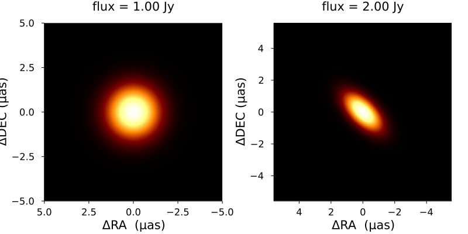
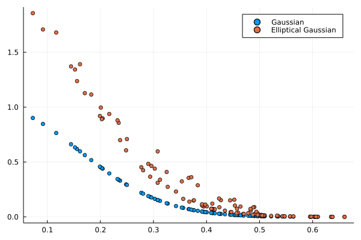

# Model Interface

## Defining the Model

`VLBISkyModels` aims to be more modular and extensible than previous VLBI modeling packages. Namely, simple models are composed to construct complicated source morphologies instead of making many different models. This is accomplished with a type and trait-based hierarchy.

Additionally, [`ComradeBase`](https://github.com/ptiede/ComradeBase.jl) is a low-dependency version of this package that defines this type and trait hierarchy that users can more easily incorporate into their packages.

To see how this works, we will go through a simplified implementation of the Gaussian model in `VLBISkyModels`. The Gaussian model is a simple, compact emission structure model that can constrain the typical characteristic size
of an image feature from VLBI data. To construct a Gaussian model, we will first define a struct:

```julia
struct MyGaussian{T} <: VLBISkyModels.AbstractModel
    size::T
end
```

where `size` is the standard deviation of the gaussian.

!!! note
    We typically do not include a `size` field in the model because a generic `size` can be specified
    with the [`modify`](@ref) function. However, for the sake of this example, we will include it,
    since it will highlight how to make models frequency dependent.

To specify the model we need to tell `VLBISkyModels` how we will represent the model in the image
and visibility domain. For a Gaussian, both the image and visibilty domain are analytic. These
are specified with the traits [`ComradeBase.visanalytic`](@ref) and [`ComradeBase.imanalytic`](@ref):

```julia
# Fourier and image domains are analytic
ComradeBase.visanalytic(::Type{<:MyGaussian}) = IsAnalytic()
ComradeBase.imanalytic(::Type{<:MyGaussian}) = IsAnalytic()
```

Finally, we can specify if the model is intrinsically polarized by using the `IsPolarized` and `NotPolarized()` trait

```julia
VLBISkyModels.ispolarized(::Type{<:MyGaussian}) = NotPolarized()
```

!!! note
    The actual implementation defines the Gaussian to be a subtype of `VLBISkyModels.GeometricModel`,
    which automatically defines these methods. However, for models that aren't a subtype of `GeometricModel`,
    we assume the image domain `IsAnalytic()` and the Fourier domain is `NotAnalytic()`.

Since both the image and visibility domain representation of the Gaussian are analytic, we need to
define an `intensity_point` and `visibility_point` method.

```julia
function ComradeBase.intensity_point(m::MyGaussian, p)
    (; X, Y) = p
    @unpack_params size = m(p)
    return exp(-(X^2 + Y^2) * inv(2 * size^2)) * inv(2π * size)
end

function ComradeBase.visibility_point(m::MyGaussian, p) where {T}
    @unpack_params size = m(p)
    return exp(-2π^2 * size^2 * (u^2 + v^2)) + 0im
end
```

Note that as of **0.6.6** we recommend retrieving the parameters of the model `m` using either
[`getparam`](@ref) or the convience macro [`@unpack_params`](@ref). This is because the parameters of the model
may not be simple numbers but functions of time and frequency. Finally, not that `@unpack_params`
is a macro that reduces boiler plate and is equivalent to,

```julia
size = getparam(m, :size, p) # identical to @unpack_params size = m(p)
```

Additionally, most models in `VLBISkyModels` has two additional functions one can implement if possible:

 1. `flux(m::MyGaussian)`: This defines the flux of a model. If this isn't defined, the model won't have a flux until an image is created. For a Gaussian, the definition is `flux(::MyGaussian) = 1.0`.
 2. `radialextent(::MyGaussian)`: This defines the model's default radial extent. For a Gaussian, we will consider the radial extent to be $5σ$, so `radialextent(m::MyGaussian) = 5.0*m.size`. Although note that for a frequency dependent Gaussian this will not work correctly.

This completely defines the model interface for `VLBISkyModels`. With this, you can call the usual user API to evaluate, fit, and plot the model. Additionally, we can start talking about
adding multiple Gaussians and modifying them. For instance, with a flux of 2 Jy. This can be created by `VLBISkyModels` as follows:

```julia
using Plots
gauss = 2.0 * MyGaussian(1.0)
fig = plot(gauss; layout=(1, 2), size=(800, 300))
plot!(fig[2], ellgauss; size=(800, 350))
```



```julia
using Plots
u = rand(100) * 0.5;
v = rand(100) * 0.5;
vg = visibilitymap(gauss, u, v)
veg = visibilitymap(ellgauss, u, v)

Plots.scatter(hypot.(u, v), abs.(vg); label="Gaussian")
Plots.scatter!(hypot.(u, v), abs.(veg); label="Elliptical Gaussian")
```



## Making the model frequency dependent

To make the model frequency dependent we can use the existing [`VLBISkyModels.DomainParams`](@ref) interface.
This defines how the model parameters behave as a function of frequency and time. For example,
to make the size of the Gaussian frequency dependent we can use the [`TaylorSpectral`](@ref) type

```julia
ν₀ = 230e9
σ₀ = 1.0
a = 1.0
size = TaylorSpectral(σ₀, a, ν₀)
gauss = MyGaussian(size)
ellgauss = 2.0 * MyGaussian(size)
```

which will make a Gaussian whose size as a function of frequency is given by

```math
\sigma(\nu) = \sigma_0 (\nu / \nu_0)^a
```

If we wanted a different function form for the frequency dependence, we can define a new type

```julia
struct MyFreq{T,F} <: VLBISkyModels.DomainParams
    a::T
    F0::F
end
```

which only requires a single method to be defined for it to work

```julia
function VLBISkyModels.build_param(param::MyFreq, p)
    return param.a + p.Fr / p.F0
end
```

which says that the depends changes as a function of frequency linearly with a slope of `F0` and
a intercept of `a`. This can be used as follows

```julia
ν₀ = 230e9
σ₀ = 1.0
size = MyFreq(1.0, ν₀)
gauss = MyGaussian(size)
```

!!! note
    This extension of the model to be time and frequency dependent is only necessary for models
    that aren't intrinsically dependent on time and frequency. For a model, that has some prescribed
    time and frequency dependence, the model should be defined explicitly in `intensity_point`/`visibility_point`
    if they are analytic in the image/visibility domain respectively.
